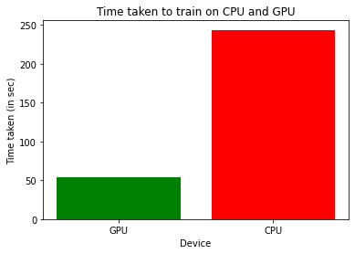

# Pytorch M1 GPU vs CPU Benchmark

System: M1 MAX GPU




## Trouble Shooting

make sure to install the desired python version with the ´--enable-framework´ flag set.
```bash

    PYTHON_CONFIGURE_OPTS="--enable-framework" pyenv install 3.9.13

```

scikit learn errors see
[Stackoverflow](https://stackoverflow.com/questions/68620927/installing-scipy-and-scikit-learn-on-apple-m1)

```bash
    brew install openblas
    export OPENBLAS=$(/opt/homebrew/bin/brew --prefix openblas)
    export CFLAGS="-falign-functions=8 ${CFLAGS}"
```

optionally: add exports into `.zshrc` or `.bashrc`, also add recommended one if wanted.